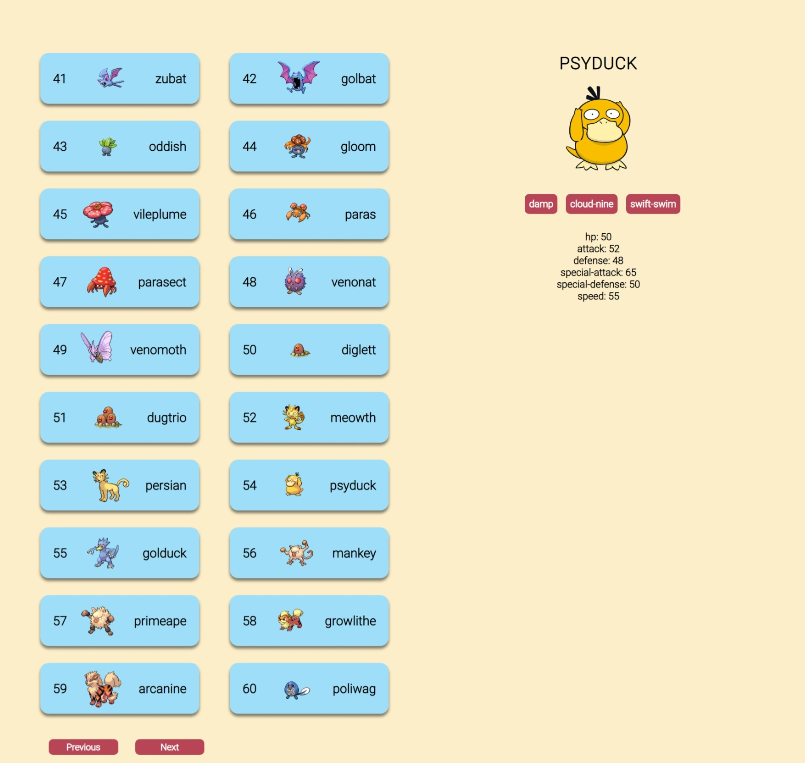

# PokeAPI 02
This design is inspired by the work of [Imaginary Engineering](https://www.youtube.com/@imaginaryengineering5566). Click [here](https://youtu.be/Iz5iNOMCIjY) to watch the video.

## Technologies
This web page was made with the following technologies:
- HTML5
- CSS3
- JavaScript
- React (useState, useEffect)
- Axios
- PokeAPI

## Pages
This web page contains 1 sections: **Home**.

### Home
#### In this section you will see different pokemons with their name and id. If you click on a pokemon in the list, more information about that pokemon will appear on the right side. At the bottom of the list, there is a functional button called "next", where if you click on it, the next 20 Pokémon will be loaded.

